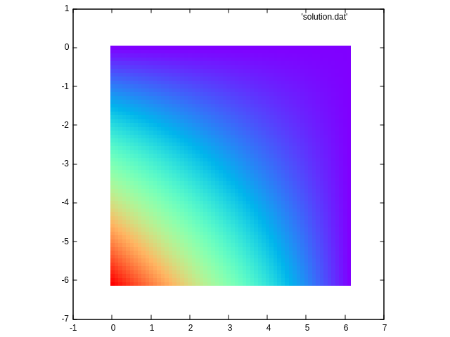

# Laplace Equation by Jacobi method
## Background

Please refer to [background](./aux/background.md)

## Exercises
1. Parallelize and optimize your C++ Jacobi code version following
   [**these assignments**](./aux/hints.md)

2. Perform a performance analysis of the code scaling, provide
   scalability charts and a brief explanation (matrix size 1200 and
   12000, 10 iterations)

## Reference result (matrix size 60, 2000 iterations)
### Initial distribution of temperature

### Final distribution of temperature (after 2000 iterations)

